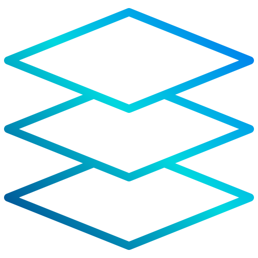

[![LinkedIn][linkedin-shield]][linkedin-url]

<!-- PROJECT LOGO -->
 

  
  <h3 align="center">Clean Python Project Template</h3>

<!-- TABLE OF CONTENTS -->

  
Table of Contents

  <ol>
    <li>
      <a href="#about-the-project">About The Project</a>
      <ul>
        <li><a href="#business-case">Business Case</a></li>
        <li><a href="#technical-solution">Technical Solution</a></li>
        <li><a href="#production-environment">Production Environment</a></li>
        <li><a href="#tech-stack">Tech Stack</a></li>
      </ul>
    </li>
    <li><a href="#contact">Contact</a></li>
  </ol>

<!-- ABOUT THE PROJECT -->
## About The Project

* Project Name: Clean Python Project Template
* Version: v1.0.0
* Organization Department: Technology

### Business Case
Lorem ipsum dolor sit amet, consectetur adipiscing elit, sed 
do eiusmod tempor incididunt ut labore et dolore magna aliqua. 
Ut enim ad minim veniam, quis nostrud exercitation ullamco 
laboris nisi ut aliquip ex ea commodo consequat. 

(<a href="#readme-top">back to top</a>)

### Technical Solution
Lorem ipsum dolor sit amet, consectetur adipiscing elit, sed 
do eiusmod tempor incididunt ut labore et dolore magna aliqua. 
Ut enim ad minim veniam, quis nostrud exercitation ullamco 
laboris nisi ut aliquip ex ea commodo consequat. 

(<a href="#readme-top">back to top</a>)

### Production Environment
**Hosting:** 

127.0.0.1

**Project Directory:**

/automation/automation_project/

**Service Accounts:** 
* SA 1
  * Access:
    * App 1
    * App 2
    * App 3
* SA 2
  * Access:
    * App 1
    * App 2
    * App 3

(<a href="#readme-top">back to top</a>)

### Tech Stack

This project was developed using the following tech stack:

* Python

(<a href="#readme-top">back to top</a>)

<!-- CONTACT -->
## Contact

Mohamed AbdelGawad Ibrahim - [@m-abdelgawad](https://www.linkedin.com/in/m-abdelgawad/) - <a href="tel:+201069052620">+201069052620</a>

(<a href="#readme-top">back to top</a>)

<!-- MARKDOWN LINKS & IMAGES -->
<!-- https://www.markdownguide.org/basic-syntax/#reference-style-links -->
[linkedin-shield]: https://img.shields.io/badge/-LinkedIn-black.svg?style=for-the-badge&logo=linkedin&colorB=555
[linkedin-url]: https://www.linkedin.com/in/m-abdelgawad/
